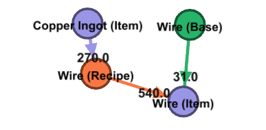
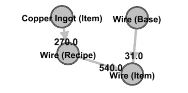
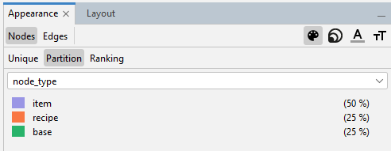
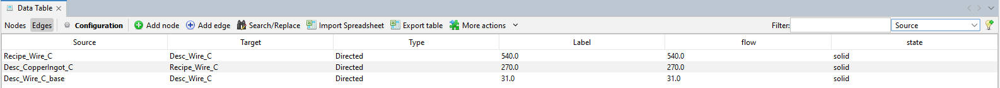

# Graph export

The state of a production can be exported to graph files using the `networkx` library.

For the guide the following data is used:

Recipe file `recipes.yml`:
```
Recipe_Wire_C: 18.0
```

Base item rate file `base_item_rate.yml`:
```
Desc_Wire_C: 31.0
```

## Create graph file
Create a directed graph of the item flow. Nodes are item rate balances, recipe amounts and base item rates:
- Item rate balances can be negative, zero or positive.
    - has attribute `node_type` set to `item`
    - has attribute `item_rate_balance`: Balance of item rate based on recipes and base item rate
- Recipe amounts integrate all factories for each recipe into a node.
    - has attribute `node_type` set to `recipe`
    - has attribute `amount`: Sum of instances of this recipe
- Base item rates are an additional rates added to the item rate balances.
    - has attribute `node_type` set to `base`
    - has attribute `item_rate`: Rate that is added to item rate balance (Can be negative)



Create the graph file with `main_export_graph.py`

```bash
python3 main_export_graph.py recipes.yml --out production.gexf --base-item-rate-file base_item_rate.yml
```

Note: The base item rate file is optional and defaults to 0.

## Visualize graph file
For this guide, the open source software [Gephi](https://gephi.org/) is used in version **0.10.1.**

1. Load the file in Gephi
Start the program and open the `production.gexf`. The import report should finish without errors.

2. Organize the network bydragging the nodes or by using **Layout**. Now the network could look like this:



3. Color the network based on the node types using the **Appearance**.



Now the network could look like this:


4. The attributes of the nodes can be investigated by the **edit** tool or the **Data Laboratory**.

