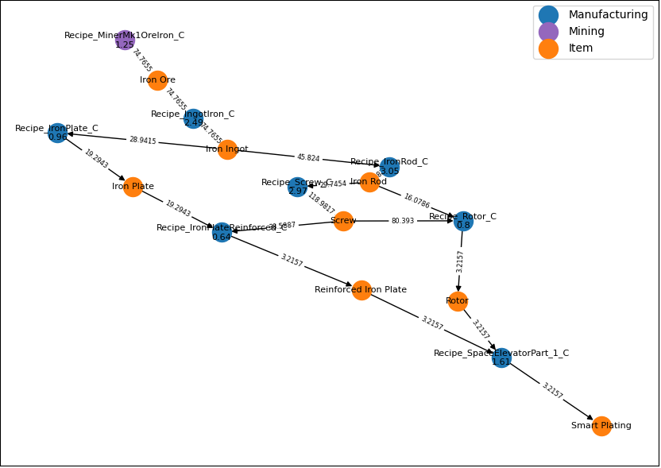

# Optimal Production

Calculate the number of each recipe to optimize the production with respect to a given objective. The optimization is constrained by available power, resource nodes and other aspects depending on the objective.


## Functionality

The class `SatisfactoryLP` manages the optimization configuration.

Optimized variables:
- Aggregated productivity rate for each recipe (e.g. 5.3x **Recipe_IngotCopper_C**, 0.8x **Recipe_AILimiter_C**, etc.)

Default constraint parameterization:
- Existing item production which can be consumed (use constructor parameter `items_available`)
- Allow production of non-sellable items. e.g. **Desc_NuclearWaste_C** (use constructor parameter `TODO`)
- Enforce balance of produced and consumed power (use constructor parameter `TODO`)
- Maximal available resource nodes (use constructor parameter `resource_nodes_available`)

Possible additional constraints:
- Production rate ratio (use method `define_sell_rate_ratio`)
- Minimal production rate (use method `define_sell_rates`)

Possible objectives:
- Maximize sink points earning rate (use method `set_objective_max_sink_points`)
- Minimize resources that need to be extracted from resource nodes or resource wells (use method `set_objective_min_resources_spent`)
- Minimize overall number of recipes (use method `set_objective_min_recipes`)
- Maximize sell rate of an item (use method `set_objective_max_item_rate`)

Only one objective can be used at a time.


## Use cases

- Make the most sink points per minute from  (use `set_objective_max_sink_points`).
- Produce the maximal possible rate of an item (use `set_objective_max_item_rate`)
- Maximize the output rate of multiple items while enforcing a ratio between the output rates (use `set_objective_max_item_rate` and `define_sell_rate_ratio`)
- Minimize the amount of resources used to achieve a given production rate of items (use `set_objective_min_resources_spent` and `define_sell_rates`)
- Minimize the number of buildings used to achieve a given production rate of items to reduce the effort to implement a production plan (use `set_objective_min_recipes` and `define_sell_rates`)

## Run

```
python3 main_optimal_production.py [-h] recipe_export_path
```
Use option `-h` for help.

## Visualize

The exported recipes can be visualized with

```
python3 scripts/plot_production.py [-h] recipe_path
```


