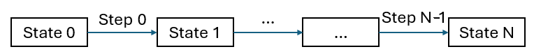

# Rapid production

Goal: What is the fastest way to produce an amount of items, given existing items and an existing production.

## Optimization concept



Idea:
- Discretize time into states (time stopped) that are connected via steps (time running)
- The tartget item amount in stock must be reached at the last state or earlier
- Recipes are active during steps and change the items in stock
- Automated recipes require investment of building costs before the start of the step which are refunded after the end of the step.
- Handcraft activities can be used without investment costs.
- Only one handcraft activity can be active at a time but different ones can be used during one step.

**Objective**: Minimize the number of time steps to reach the target item amount

Optimized variables (over multiple time steps):
- amounts of automated recipes
- amounts of handcrafted recipes

Note: The optimization is run in binary search over the number of time steps using a fixed step duration. A larger number of steps (while reducing the step duration) improves the result be runtime will grow (see known issues below).

## Simplifications

| Assistory Rapid Production Problem | Satisfactory |
| --- | --- |
| Items flow freely and instantly between all recipes (including handcraft recipes) | the transport takes time and effort to build conveyor belts |
| Items are continous flow | Items are generated chunkwise (when recipe finished) |
| Factories run without power | Factories required power and therefore generators |
| Recipes only cost the building costs when created | Additional costs of item transportation, power connections and potentially structural buildings |

For more details see [mathmatical definition](./rapid_production_definition.md) of the problem.

## Run
```
usage: main_rapid_production.py [-h] [--out OUT] [--debug] [--store-rounded] rapid_production_config

positional arguments:
  rapid_production_config
                        Path to an RapidProductionConfig

optional arguments:
  -h, --help            show this help message and exit
  --out OUT             A JSON file to store the results
  --debug               Print additional details
  --store-rounded       Additionally, store the production plan rounded to ROUND_NDIGITS digits
```

Additionally, the [rapid production notebook](../rapid_production.ipynb) can be used as interactive application.

For details about the configuration file, see the classes
1. `RapidProductionProblemUserConfig` in [main_rapid_production.py](../main_rapid_production.py)
2. `RapidProductionProblemConfig` in [rapid_production_problem_config.py](../assistory/optim/rapid_production_problem_config.py)


## Output

The result of the optimization is a rapid plan if the problem can be solved. For more details about the rapid plan please look at [rapid_plan.py](../assistory/optim/rapid_plan.py).

### Console
Example console output:
```
Number of involved recipes: 29
Search solution in minimal number of steps
-----------------
Test with #steps:  10
Create problem...
Number of variables = 430
Number of constraints = 438
Optimize...
Problem processed in 152 milliseconds
Iterations sufficient
-----------------
...
-----------------
Test with #steps:  1
Create problem...
Number of variables = 43
Number of constraints = 96
Optimize...
Problem processed in 34 milliseconds
Iterations insufficient
Minimal number of steps: 2
{'recipes': {0: {'automated': {'Recipe_MinerMk1OreIron_C': 1.0},
                 'factories': {'Recipe_MinerMk1OreIron_C': 1.0},
                 'handcraft': {'Recipe_IngotIron_C': 0.75}},
             1: {'automated': {'Recipe_MinerMk1OreIron_C': 1.0},
                 'factories': {'Recipe_MinerMk1OreIron_C': 1.0},
                 'handcraft': {'Recipe_IngotIron_C': 0.375,
                               'Recipe_IronRod_C': 0.375}}},
 'step_count': 2,
 'step_duration': 1}
```

### Output file
The **.yml** output file is generated when using the `--out` argument. It contains the amount of recipes active and the required buildings for the recipes at each step. To follow the plan, update the production accordingly.

Example rapid plan **.yml** file:
```
recipes:
    0:
        automated:
            Recipe_MinerMk1OreIron_C: 1.0
        factories:
            Recipe_MinerMk1OreIron_C: 1.0
        handcraft:
            Recipe_IngotIron_C: 0.75
    1:
        automated:
            Recipe_MinerMk1OreIron_C: 0.9999999999999997
        factories:
            Recipe_MinerMk1OreIron_C: 1.0
        handcraft:
            Recipe_IngotIron_C: 0.375
            Recipe_IronRod_C: 0.375
step_count: 2
step_duration: 1
```

## Known issues

### Long runtime
The optimization can take very long due to the use of integer values. Mostly, a high number of iterations (>5) and many unlocked recipes increase the optimization duration to several minutes or hours. Idealy, start with few iterations and increase the amount while runtime is acceptable.

### Infeasibility
If there are already some production facilities that should be extended, the item rate balance can be passed in as parameter in the `rapid_production_config`. If the balance contains negative values, i.e. it consumes more items of some type than produces it, the rapid plan has to rebuild the missing production besides reaching the target. Some configurations might be infeasible. Provide sufficient items in the `base_item.yml`, i.e. in the inventory, balance the consumption.
