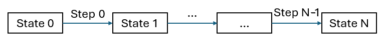

# Rapid Production - Mathmatical Definition

Goal: What is the fastest way to produce an amount of items, given the existing items $S$, goal items $G$ amount and the existing production $E$.

Idea: Discritize the time into N timesteps. Every step, add produced items to the current items and invest into new production facilities using the current items availble.

## Iterative Production
First the problem of iterative steps is explained. Later, the number of steps is optimized.

Each step consists of the following actions:
1. Build factories used in step -> subtract investment costs from state
2. Execute recipes over the step duration -> add production balance to state
3. Dismantle factories used in step -> add investment costs to state

Effectively, only the production balance is added to the state but the investment must be affordable without making the state negative.

### Constants
- steps $ \mathbf{F} = \{0, ..., N-1\}\\ $
- states $ \mathbf{T} = \{0, 1, ..., N\}\\ $
- automated recipes $ \mathbf{R}^A = \{1, ..., K\}\\ $
- handcrafted recipes $ \mathbf{R}^H = \{1, ..., L\} \\ $
- items $ \mathbf{I} = \{1, ..., M\}\\ $
- start amount $ \mathbf{S} \\ $
- goal amount $ \mathbf{G} \\ $
- existing item rate $ \mathbf{E} \\ $
- Production matrix of automated and handcraft recipes $ A^A, A^H $ (in items/minute)
- Cost matrix of automated recipes $ B^A \\ $
- Step duration $ \Delta_{step} $ (in minutes)
- Handcraft efficiency ratio $ \alpha^H $

### Variables
- automated recipe r potentially suitably clocked down at step f
$$
z^A_{r,f} \in \mathbb{R} \space \forall r \in \mathbf{R}^A,  \space \forall f \in \mathbf{F}
$$

- Upper limit of automated recipes at step f
$$
u^A_{r,f} \in \mathbb{Z} \space \forall r \in \mathbf{R}^A,  \space \forall f \in \mathbf{F}
$$

- Handcraft recipe r at step f
$$
z^H_{r,f} \in [0,1] \space \forall r \in \mathbf{R}^H,  \space \forall f \in \mathbf{F}
$$

### Helper terms
- Investment costs (items) for step f
$$
v_{i,f} = \sum_{r \in \mathbf{R}^A} B^A_{i,r} u^A_{r,f}  \space \forall i \in \mathbf{I}, \forall f \in \mathbf{F}\\
$$

- Production rate of automated recipes at step f
$$ 
p^A_{i,f} = E_i + \sum_{r \in \mathbf{R}^A} A^A_{i,r} z^A_{r,f} \space \forall i \in \mathbf{I}, \forall f \in \mathbf{F}
$$

- Production rate of handcraft recipes at step f
$$
p^H_{i,f} = \sum_{r \in \mathbf{R^H}} A^H_{i,r} z^H_{r,f} \space \forall i \in \mathbf{I}, \forall f \in \mathbf{F}
$$

- State is items in stock: new state is old state plus production of past step (updated as long as allowed). Suffient investment costs are checked in constraints.
$$
x_{i,0} = S_i \space \forall i \in \mathbf{I}\\
\space\\
x_{i,t} = x_{i,t-1} + \Delta_{step} * (p^A_{i,t-1} + p^H_{i,t-1})
    \space \forall i \in \mathbf{I}, \space \forall t \in \mathbf{T} \setminus \{0\} 
$$

### Objective
Minimize the recipes needed to achieve the goal items amount:

$$
min \sum_{f \in \mathbf{F}} \{ \sum_{r \in \mathbf{R}^A} z^A_{r,f} + \sum_{r \in \mathbf{R}^H} z^H_{r,f} \}\\
$$

### Constraints
- Item amounts in stock (=states) including next investment costs are nonnegative. Investment costs are always positive, therefore, the production of the previous step applies can not cause a negative item amount.
$$
x_{i,f} - v_{i,f} \ge 0 \space \forall i \in \mathbf{I}, \space \forall f \in \mathbf{F}  
\space\\
x_{i,N} \ge 0 \space \forall i \in \mathbf{I}
$$

- Goal items reached at end
$$ x_{i,N} \ge G_i \space \forall i \in \mathbf{I} $$

- Handcraft efficiency reduced by item logistics and recipe change
$$
\sum_{r \in \mathbf{R^H}} z^H_{r,f} \le \alpha^H \space \forall f \in \mathbf{F}
$$

- Rounded up amounts of automated recipes is upper limit for clocked recipes
$$
z^A_{r,f} \le u^A_{r,f} \space \forall r \in \mathbf{R}^A, \space \forall f \in \mathbf{F}
$$

## Optimal number of steps
Jointly optimizing the number of steps is not possible with the above formulation as linear problem. Therefore the optimal number of steps is calculated by binary search.
